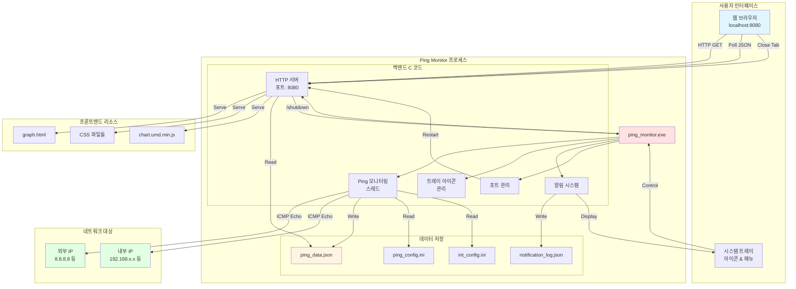
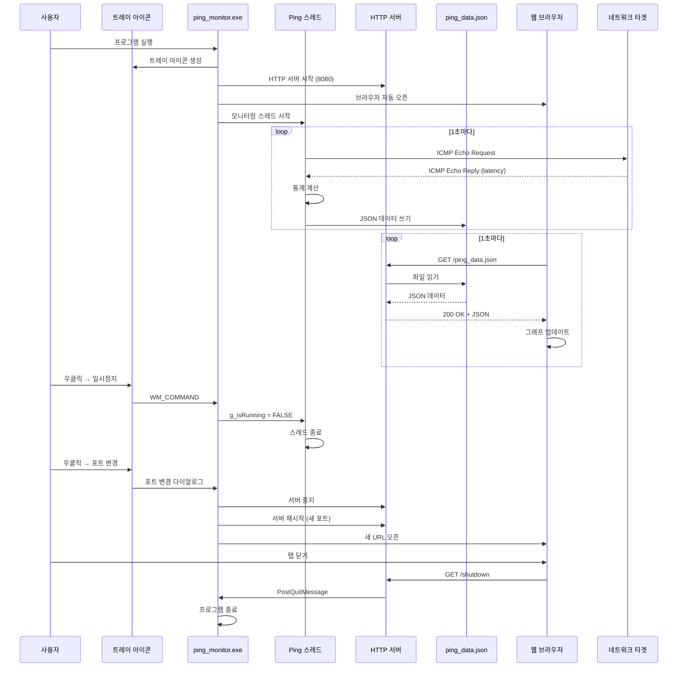

[메인으로 돌아가기](../README.md)

## 문서

- [시스템 아키텍처](docs/ARCHITECTURE.md)
- [파일 구조 및 배포](docs/FILE_STRUCTURE.md)
- [설치 및 빌드 가이드](docs/INSTALLATION.md)
- [사용자 가이드](docs/USER_GUIDE.md)
- [설정 파일 상세](docs/CONFIGURATION.md)
- [문제 해결](docs/TROUBLESHOOTING.md)
- [버전 변경 이력](docs/CHANGELOG.md)

---

## 2. ARCHITECTURE.md

**포함 내용:**

- 시스템 전체 구조 다이어그램
- 데이터 흐름 시퀀스 다이어그램
- 컴포넌트 구조 및 설명
- 기술 스택 상세
- 네트워크 통신 프로토콜
- 스레드 모델
- 메모리 관리

### 전체 구조



### 데이터 흐름



### 컴포넌트 구조

```
ping_monitor.exe
├─ Windows API
│  ├─ WinMain() - 진입점
│  ├─ WndProc() - 메시지 처리
│  └─ PortDialogProc() - 포트 변경 다이얼로그
│
├─ 네트워크 모듈
│  ├─ DoPing() - ICMP ping 실행
│  ├─ UpdateTarget() - 통계 업데이트
│  └─ MonitoringThread() - 모니터링 루프
│
├─ HTTP 서버 모듈 (http_server.c)
│  ├─ StartHttpServer() - 서버 시작
│  ├─ HttpServerThread() - 요청 처리
│  ├─ HandleClient() - 클라이언트 핸들러
│  └─ StopHttpServer() - 서버 중지
│
├─ 알림 모듈
│  ├─ CheckAndNotify() - 조건 검사
│  ├─ ShowBalloonNotification() - 트레이 알림
│  └─ SaveNotificationLog() - 로그 저장
│
├─ 설정 모듈
│  ├─ LoadConfig() - 설정 로드
│  └─ LoadConfigFromFile() - 파일 파싱
│
└─ 포트 관리 모듈
   ├─ IsPortAvailable() - 포트 사용 여부
   ├─ FindAvailablePort() - 빈 포트 탐색
   ├─ ChangeServerPort() - 포트 변경 UI
   └─ RestartServer() - 서버 재시작
```

---

## 📁 파일 구조

```
프로젝트/
├── ping_monitor_webview.c      # 메인 프로그램 (C)
├── http_server.c               # HTTP 서버 구현
├── http_server.h               # HTTP 서버 헤더
├── build.bat                   # 빌드 스크립트
├── ping_config.ini             # 공개 IP 설정 ← Git 포함 ✅
├── int_config.ini              # 내부 IP 실제 ← Git 제외 ⛔
├── .gitignore                  # Git 제외 목록
├── README.md                   # 이 문서
├── graph.html                  # 웹 대시보드
└── css/
    ├── variables.css           # CSS 변수 (색상)
    ├── base.css                # 기본 스타일
    ├── components.css          # 컴포넌트
    ├── dashboard.css           # 대시보드
    ├── notifications.css       # 알림
    └── responsive.css          # 반응형
```

---

## 🛠️ 기술 스택

### 백엔드 (C)

| 기술                | 용도                           |
| ------------------- | ------------------------------ |
| **WinSock2**        | TCP/IP 네트워크 통신           |
| **ICMP API**        | ICMP Echo Request/Reply (ping) |
| **Windows API**     | 시스템 트레이, 윈도우 관리     |
| **Multi-threading** | 비동기 ping 모니터링           |
| **JSON**            | 데이터 직렬화 (수동 구현)      |

### 프론트엔드

| 기술                 | 용도                 |
| -------------------- | -------------------- |
| **HTML5**            | 대시보드 마크업      |
| **CSS3**             | 반응형 스타일링      |
| **JavaScript (ES6)** | 동적 UI, 데이터 폴링 |
| **Chart.js 4.4.0**   | 실시간 라인 차트     |
| **localStorage**     | 클라이언트 상태 저장 |

### HTTP 서버

- **Custom C Implementation**: 경량 HTTP/1.1 서버
- **포트**: 기본 8080 (변경 가능: 8000-9000)
- **MIME Types**: html, css, js, json, ico
- **엔드포인트**:
  - `GET /graph.html` - 대시보드
  - `GET /ping_data.json` - 실시간 데이터
  - `GET /notification_log.json` - 알림 로그
  - `GET /shutdown` - 프로그램 종료
