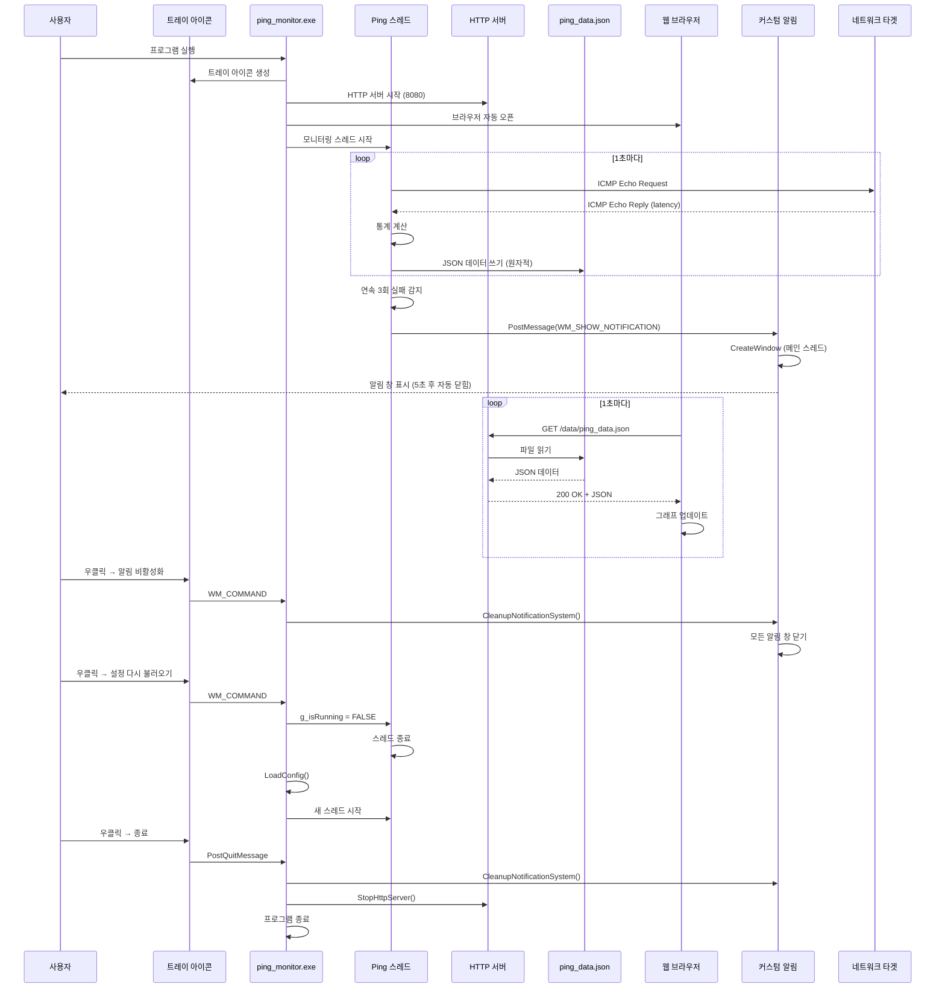

# 2. ARCHITECTURE.md

[메인으로 돌아가기](../README.md)

## 문서

- [시스템 아키텍처](ARCHITECTURE.md)
- [파일 구조 및 배포](FILE_STRUCTURE.md)
- [설치 및 빌드 가이드](INSTALLATION.md)
- [사용자 가이드](USER_GUIDE.md)
- [설정 파일 상세](CONFIGURATION.md)
- [문제 해결](TROUBLESHOOTING.md)
- [버전 변경 이력](CHANGELOG.md)

---

## 📋 포함 내용

- 시스템 전체 구조 다이어그램
- 데이터 흐름 시퀀스 다이어그램
- 컴포넌트 구조 및 설명
- 기술 스택 상세
- 네트워크 통신 프로토콜
- 커스텀 알림 시스템
- 모듈 구조

---

## 🏗️ 전체 구조

```mermaid
graph TB
    subgraph "사용자 인터페이스"
        Browser[웹 브라우저<br/>localhost:8080]
        Tray[시스템 트레이<br/>아이콘 & 메뉴]
        CustomNotif[커스텀 알림 창<br/>Outlook 스타일]
    end

    subgraph "Ping Monitor 프로세스"
        Main[ping_monitor.exe]

        subgraph "백엔드 C 코드"
            PingThread[Ping 모니터링<br/>스레드]
            HTTPServer[HTTP 서버<br/>포트: 8080-8099]
            TrayIcon[트레이 아이콘<br/>관리]
            NotifSystem[커스텀 알림<br/>시스템]
            PortMgr[포트 관리]
            OutageMgr[장애 관리]
        end

        subgraph "데이터 저장"
            PingData[ping_data.json]
            NotifLog[notification_log.json]
            OutageLog[outage_log.json]
            Config1[ping_config.ini]
            Config2[int_config.ini]
        end
    end

    subgraph "프론트엔드 리소스"
        HTML[graph.html]
        CSS[CSS 파일들 (8개)]
        ChartJS[chart.umd.min.js]
    end

    subgraph "네트워크 대상"
        Target1[외부 IP<br/>8.8.8.8 등]
        Target2[내부 IP<br/>192.168.x.x 등]
    end

    Browser -->|HTTP GET| HTTPServer
    HTTPServer -->|Serve| HTML
    HTTPServer -->|Serve| CSS
    HTTPServer -->|Serve| ChartJS
    Browser -->|Poll JSON| HTTPServer
    HTTPServer -->|Read| PingData
    HTTPServer -->|Read| NotifLog
    HTTPServer -->|Read| OutageLog

    Tray -->|Control| Main
    Main --> PingThread
    Main --> HTTPServer
    Main --> TrayIcon
    Main --> NotifSystem
    Main --> PortMgr
    Main --> OutageMgr

    PingThread -->|ICMP Echo| Target1
    PingThread -->|ICMP Echo| Target2
    PingThread -->|Write| PingData
    PingThread -->|Track| OutageMgr

    PingThread -->|Read| Config1
    PingThread -->|Read| Config2

    NotifSystem -->|Write| NotifLog
    NotifSystem -->|Display| CustomNotif
    OutageMgr -->|Write| OutageLog

    PortMgr -->|Restart| HTTPServer

    Browser -->|Close Tab| HTTPServer
    HTTPServer -->|/shutdown| Main

    style Browser fill:#e1f5ff
    style Main fill:#ffe1e1
    style PingData fill:#fff4e1
    style Target1 fill:#e1ffe1
    style Target2 fill:#e1ffe1
    style CustomNotif fill:#ffe1ff
```

---

## 📊 데이터 흐름



---

## 🧩 컴포넌트 구조

```
ping_monitor.exe
├─ Windows API
│  ├─ wWinMain() - 진입점 (UNICODE)
│  ├─ WndProc() - 메시지 처리
│  └─ CheckRequiredFiles() - 필수 파일 검증
│
├─ 모듈 시스템 (module/)
│  ├─ types.h - 전역 타입 정의
│  ├─ config.c/h - 설정 파일 로딩
│  ├─ network.c/h - ICMP 핑 모니터링
│  ├─ notification.c/h - 커스텀 알림 시스템
│  ├─ port.c/h - 포트 관리 다이얼로그
│  └─ tray.c/h - 시스템 트레이 관리
│
├─ HTTP 서버 모듈 (http_server.c/h)
│  ├─ StartHttpServer() - 서버 시작
│  ├─ HttpServerThread() - 요청 처리
│  ├─ HandleClient() - 클라이언트 핸들러
│  └─ StopHttpServer() - 서버 중지
│
├─ 장애 관리 모듈 (outage.c/h)
│  ├─ InitOutageSystem() - 초기화
│  ├─ CheckOutage() - 장애 판정 (5분 임계값)
│  ├─ StartOutage() - 장애 시작 기록
│  ├─ EndOutage() - 장애 복구 기록
│  └─ SaveOutageLog() - outage_log.json 저장
│
├─ 브라우저 모니터 (browser_monitor.c/h)
│  ├─ InitializeBrowserMonitor() - 모니터 초기화
│  ├─ OpenBrowser() - CreateProcess로 브라우저 실행
│  ├─ CheckBrowserStatus() - 프로세스 상태 확인
│  └─ CleanupBrowserMonitor() - 핸들 정리
│
└─ 설정 API (config_api.c/h)
   ├─ HandleConfigRequest() - GET /config 처리
   └─ ServeIniFile() - INI 파일 서빙
```

---

## 🛠️ 기술 스택

### 백엔드 (C)

| 기술                | 용도                                 | 버전      |
| ------------------- | ------------------------------------ | --------- |
| **WinSock2**        | TCP/IP 네트워크 통신                 | Windows   |
| **ICMP API**        | ICMP Echo Request/Reply (ping)       | Windows   |
| **Windows API**     | 시스템 트레이, 윈도우 관리, GDI 폰트 | Windows   |
| **Multi-threading** | 비동기 ping 모니터링                 | pthread-w |
| **JSON**            | 데이터 직렬화 (수동 구현)            | N/A       |
| **GCC MinGW-w64**   | 컴파일러                             | 14.2.0    |

### 프론트엔드

| 기술                 | 용도                  | 버전  |
| -------------------- | --------------------- | ----- |
| **HTML5**            | 대시보드 마크업       | -     |
| **CSS3**             | 반응형 스타일링       | -     |
| **JavaScript (ES6)** | 동적 UI, 데이터 폴링  | -     |
| **Chart.js**         | 실시간 라인 차트      | 4.4.0 |
| **localStorage**     | 클라이언트 상태 저장  | -     |

### HTTP 서버

- **Custom C Implementation**: 경량 HTTP/1.1 서버
- **포트**: 기본 8080 (변경 가능: 8080-8099 자동 탐색)
- **MIME Types**: html, css, js, json, ico
- **엔드포인트**:
  - `GET /web/graph.html` - 대시보드
  - `GET /data/ping_data.json` - 실시간 데이터
  - `GET /data/notification_log.json` - 알림 로그
  - `GET /data/outage_log.json` - 장애 로그
  - `GET /config/ping_config.ini` - 설정 파일 (읽기 전용)
  - `POST /shutdown` - 프로그램 종료

---

## 🔔 커스텀 알림 시스템

### 개요

v2.6에서 도입된 **Outlook 스타일 커스텀 알림 창**은 Windows 기본 balloon 알림을 대체합니다.

### 핵심 특징

- **위치**: 화면 우하단 (트레이 아이콘을 가리지 않음)
- **스타일**: 다크 테마 (RGB 45, 45, 48)
- **애니메이션**: 페이드 인/아웃 (0.4초)
- **자동 닫힘**: 5초 후
- **수동 닫기**: 클릭 시 즉시
- **최대 개수**: 5개 동시 표시
- **스레드 안전**: PostMessage 방식

### 아키텍처

```
[별도 스레드에서 알림 발생]
    ↓
ShowCustomNotification()
    ↓
NotificationRequest 구조체 생성 (동적 할당)
    ↓
PostMessage(WM_SHOW_NOTIFICATION, req)
    ↓
[메인 스레드로 전환]
    ↓
WM_SHOW_NOTIFICATION 수신
    ↓
ProcessShowNotification(req)
    ↓
CreateWindowExW() - 알림 창 생성
SetLayeredWindowAttributes() - 투명도 설정
ShowWindow(SW_SHOWNA) - 비활성 표시
SetTimer(5000ms) - 자동 닫힘 타이머
    ↓
free(req) - 메모리 해제
```

### 구조체

```c
// 알림 창 정보
typedef struct {
    HWND hwnd;
    wchar_t title[128];
    wchar_t message[256];
    DWORD type;         // NIIF_WARNING, NIIF_INFO, NIIF_ERROR
    DWORD startTime;
} NotificationWindow;

// PostMessage 전달용
typedef struct {
    wchar_t title[128];
    wchar_t message[256];
    DWORD type;
} NotificationRequest;
```

### 윈도우 속성

```c
// 창 스타일
WS_POPUP

// 확장 스타일
WS_EX_TOPMOST       // 최상위
WS_EX_TOOLWINDOW    // 작업 표시줄 제외
WS_EX_LAYERED       // 투명도 지원
WS_EX_NOACTIVATE    // 포커스 빼앗지 않음

// 크기
350 x 100 픽셀

// 투명도
250/255 (약 98%)

// 위치
화면 우하단에서 10px 간격으로 수직 정렬
```

### 폰트 캐싱

```c
// 전역 변수 (초기화 시 한 번만 생성)
static HFONT g_titleFont = NULL;    // 16pt Bold
static HFONT g_messageFont = NULL;  // 14pt Normal

void InitNotificationSystem(void) {
    g_titleFont = CreateFontW(16, ..., FW_BOLD, ...);
    g_messageFont = CreateFontW(14, ..., FW_NORMAL, ...);
    RegisterClassW(&g_notificationClass);
}
```

### 성능 최적화

1. **폰트 캐싱**: WM_PAINT마다 생성하지 않고 전역 폰트 재사용
2. **WM_ERASEBKGND 처리**: 배경 깜빡임 제거
3. **UpdateWindow() 제거**: 메시지 루프 블로킹 방지
4. **CS_DROPSHADOW 제거**: 렌더링 오버헤드 감소

### 알림 유형

| 타입           | 아이콘 색상             | 제목                  | 사용 케이스      |
| -------------- | ----------------------- | --------------------- | ---------------- |
| NIIF_WARNING   | RGB(255, 165, 0) 주황색 | ⚠️ 네트워크 타임아웃 | 연속 3회 실패    |
| NIIF_INFO      | RGB(80, 200, 120) 초록색| ✅ 네트워크 복구     | 오프라인→온라인 |
| NIIF_ERROR     | RGB(220, 50, 50) 빨간색 | ❌ 심각한 오류       | (미사용)         |

---

## 🔧 모듈 구조

### types.h (전역 타입 정의)

```c
#define MAX_IP_COUNT 100
#define MAX_HISTORY 60

typedef struct {
    wchar_t ip[50];
    wchar_t name[100];
    BOOL online;
    DWORD latency;
    // ... (생략)
} IPTarget;

typedef struct {
    BOOL enabled;
    int cooldown;
    BOOL notifyOnTimeout;
    BOOL notifyOnRecovery;
    int consecutiveFailuresThreshold;
} NotificationSettings;

typedef struct {
    int outageThreshold;  // 장애 판정 임계값 (초)
} OutageSettings;
```

### config.c/h (설정 로딩)

```c
void LoadConfig(void);
void LoadConfigFromFile(const wchar_t* filename);
void LoadNotificationSettings(void);
```

- ping_config.ini와 int_config.ini 병합
- [Settings], [Targets], [OutageDetection] 섹션 파싱
- 전역 변수 g_targets[], g_targetCount 업데이트

### network.c/h (네트워크 모니터링)

```c
DWORD WINAPI MonitoringThread(LPVOID lpParam);
BOOL DoPing(const wchar_t* ipAddress);
void UpdateTarget(IPTarget* target, BOOL success, DWORD latency);
void SavePingData(void);
void CheckAndNotify(IPTarget* target);
```

- ICMP 핑 실행
- 통계 계산 (평균, 최소, 최대, 성공률)
- JSON 파일 생성 (원자적 쓰기)
- 알림 조건 체크

### notification.c/h (커스텀 알림)

```c
void InitNotificationSystem(void);
void ShowCustomNotification(const wchar_t* title, const wchar_t* message, DWORD type);
void ProcessShowNotification(NotificationRequest* req);
void CleanupNotificationSystem(void);
LRESULT CALLBACK NotificationWindowProc(HWND hwnd, UINT msg, WPARAM wParam, LPARAM lParam);
```

- 커스텀 알림 창 생성/관리
- PostMessage 기반 스레드 안전 처리
- 5초 자동 닫힘, 클릭 닫기
- 최대 5개 동시 표시

### port.c/h (포트 관리)

```c
BOOL IsPortAvailable(int port);
int FindAvailablePort(int startPort, int endPort);
void ChangeServerPort(HWND hwnd);
```

- 포트 사용 가능 여부 확인
- 8080-8099 범위에서 빈 포트 탐색
- 포트 변경 다이얼로그 표시

### tray.c/h (시스템 트레이)

```c
void InitTrayIcon(HWND hwnd);
void RemoveTrayIcon(void);
void ShowTrayMenu(HWND hwnd);
```

- 트레이 아이콘 생성/제거
- 우클릭 메뉴 표시
- 트레이 메시지 처리

---

## 📚 참고 자료

### Windows API

- [CreateProcess](https://docs.microsoft.com/en-us/windows/win32/api/processthreadsapi/nf-processthreadsapi-createprocessw) - 프로세스 생성
- [PostMessage](https://docs.microsoft.com/en-us/windows/win32/api/winuser/nf-winuser-postmessagew) - 스레드 간 메시지 전달
- [CreateWindowEx](https://docs.microsoft.com/en-us/windows/win32/api/winuser/nf-winuser-createwindowexw) - 윈도우 생성
- [SetLayeredWindowAttributes](https://docs.microsoft.com/en-us/windows/win32/api/winuser/nf-winuser-setlayeredwindowattributes) - 투명도 설정
- [CreateFont](https://docs.microsoft.com/en-us/windows/win32/api/wingdi/nf-wingdi-createfontw) - 폰트 생성

### Chart.js

- [Chart.js Documentation](https://www.chartjs.org/docs/latest/) - 공식 문서
- [Line Chart](https://www.chartjs.org/docs/latest/charts/line.html) - 라인 차트 가이드

### MinGW-w64

- [MinGW-w64 공식 사이트](https://www.mingw-w64.org/)
- [GCC Documentation](https://gcc.gnu.org/onlinedocs/)
