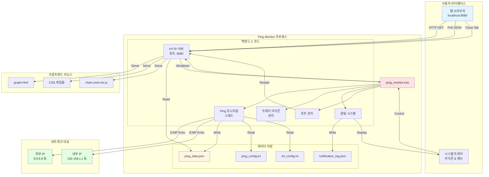
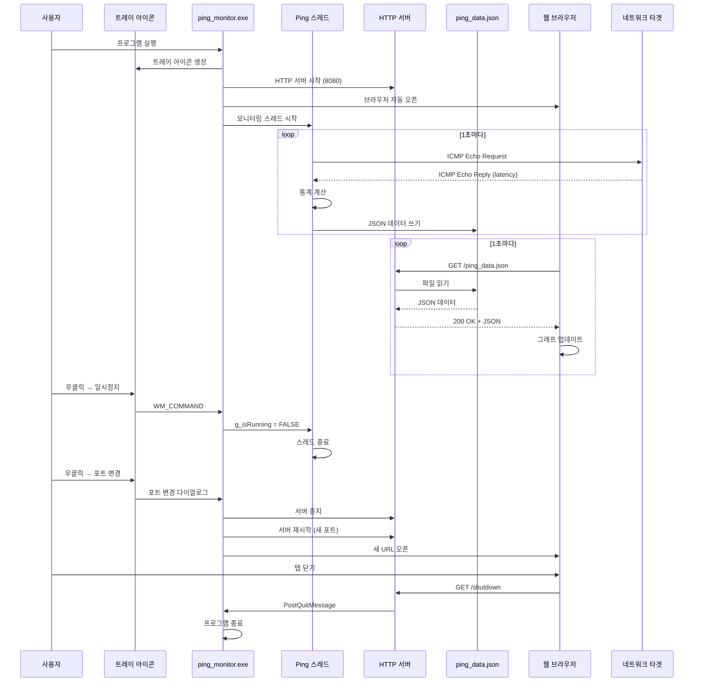

# 2. ARCHITECTURE.md

[메인으로 돌아가기](../README.md)

## 문서

- [시스템 아키텍처](ARCHITECTURE.md)
- [파일 구조 및 배포](FILE_STRUCTURE.md)
- [설치 및 빌드 가이드](INSTALLATION.md)
- [사용자 가이드](USER_GUIDE.md)
- [설정 파일 상세](CONFIGURATION.md)
- [문제 해결](TROUBLESHOOTING.md)
- [버전 변경 이력](CHANGELOG.md)

---

**포함 내용:**

- 시스템 전체 구조 다이어그램
- 데이터 흐름 시퀀스 다이어그램
- 컴포넌트 구조 및 설명
- 기술 스택 상세
- 네트워크 통신 프로토콜
- 스레드 모델
- 메모리 관리

### 전체 구조



### 데이터 흐름



### 컴포넌트 구조

```
ping_monitor.exe
├─ Windows API
│  ├─ WinMain() - 진입점
│  ├─ WndProc() - 메시지 처리
│  └─ PortDialogProc() - 포트 변경 다이얼로그
│
├─ 네트워크 모듈
│  ├─ DoPing() - ICMP ping 실행
│  ├─ UpdateTarget() - 통계 업데이트
│  └─ MonitoringThread() - 모니터링 루프
│
├─ HTTP 서버 모듈 (http_server.c)
│  ├─ StartHttpServer() - 서버 시작
│  ├─ HttpServerThread() - 요청 처리
│  ├─ HandleClient() - 클라이언트 핸들러
│  └─ StopHttpServer() - 서버 중지
│
├─ 알림 모듈
│  ├─ CheckAndNotify() - 조건 검사
│  ├─ ShowBalloonNotification() - 트레이 알림
│  └─ SaveNotificationLog() - 로그 저장
│
├─ 설정 모듈
│  ├─ LoadConfig() - 설정 로드
│  └─ LoadConfigFromFile() - 파일 파싱
│
└─ 포트 관리 모듈
   ├─ IsPortAvailable() - 포트 사용 여부
   ├─ FindAvailablePort() - 빈 포트 탐색
   ├─ ChangeServerPort() - 포트 변경 UI
   └─ RestartServer() - 서버 재시작
```

---

## 📁 파일 구조

```
프로젝트/
├── ping_monitor_webview.c      # 메인 프로그램 (C)
├── http_server.c               # HTTP 서버 구현
├── http_server.h               # HTTP 서버 헤더
├── build.bat                   # 빌드 스크립트
├── ping_config.ini             # 공개 IP 설정 ← Git 포함 ✅
├── int_config.ini              # 내부 IP 실제 ← Git 제외 ⛔
├── .gitignore                  # Git 제외 목록
├── README.md                   # 이 문서
├── graph.html                  # 웹 대시보드
└── css/
    ├── variables.css           # CSS 변수 (색상)
    ├── base.css                # 기본 스타일
    ├── components.css          # 컴포넌트
    ├── dashboard.css           # 대시보드
    ├── notifications.css       # 알림
    └── responsive.css          # 반응형
```

---

## 🛠️ 기술 스택

### 백엔드 (C)

| 기술                | 용도                           |
| ------------------- | ------------------------------ |
| **WinSock2**        | TCP/IP 네트워크 통신           |
| **ICMP API**        | ICMP Echo Request/Reply (ping) |
| **Windows API**     | 시스템 트레이, 윈도우 관리     |
| **Multi-threading** | 비동기 ping 모니터링           |
| **JSON**            | 데이터 직렬화 (수동 구현)      |

### 프론트엔드

| 기술                 | 용도                 |
| -------------------- | -------------------- |
| **HTML5**            | 대시보드 마크업      |
| **CSS3**             | 반응형 스타일링      |
| **JavaScript (ES6)** | 동적 UI, 데이터 폴링 |
| **Chart.js 4.4.0**   | 실시간 라인 차트     |
| **localStorage**     | 클라이언트 상태 저장 |

### HTTP 서버

- **Custom C Implementation**: 경량 HTTP/1.1 서버
- **포트**: 기본 8080 (변경 가능: 8000-9000)
- **MIME Types**: html, css, js, json, ico
- **엔드포인트**:
  - `GET /graph.html` - 대시보드
  - `GET /ping_data.json` - 실시간 데이터
  - `GET /notification_log.json` - 알림 로그
  - `GET /shutdown` - 프로그램 종료

---

# 브라우저 닫힘 즉시 감지 시스템

## 📌 개요

Ping Monitor v2.6는 브라우저 창을 닫으면 **1초 이내**에 프로그램이 자동 종료되는 기능을 제공합니다.

### 핵심 원리
- 브라우저를 **독립 프로세스**로 실행
- 프로세스 핸들을 통해 **실시간 상태 모니터링**
- 브라우저 종료 감지 시 **프로그램 자동 종료**
- 모든 데이터 파일은 **보존**

---

## 🔧 기술 구현

### 1. 브라우저 실행 방식 변경

#### ❌ 기존 방식 (ShellExecuteW)
```c
// 문제: 독립 프로세스로 실행되어 추적 불가능
void OpenBrowser(const wchar_t* url)
{
    ShellExecuteW(NULL, L"open", url, NULL, NULL, SW_SHOWNORMAL);
    // 프로세스 핸들 없음 - 브라우저 상태 추적 불가능
}
```

**한계점:**
- 브라우저가 독립 프로세스로 실행
- 프로세스 핸들을 얻을 수 없음
- 브라우저 닫힘 감지 불가능

#### ✅ 새로운 방식 (CreateProcess)
```c
// 해결: CreateProcess로 프로세스 핸들 획득
STARTUPINFOW si = {0};
PROCESS_INFORMATION pi = {0};

CreateProcessW(NULL, cmdLine, NULL, NULL, FALSE, 0, NULL, NULL, &si, &pi);

g_browserProcess = pi.hProcess;      // 핸들 저장!
g_browserProcessId = pi.dwProcessId;  // PID 저장!
CloseHandle(pi.hThread);
```

**장점:**
- 프로세스 핸들 획득 가능
- 프로세스 상태 실시간 모니터링 가능
- 브라우저 종료 즉시 감지 가능

---

### 2. 기본 브라우저 경로 탐색

#### 레지스트리 경로
```
1. HKEY_CURRENT_USER\Software\Microsoft\Windows\Shell\Associations\
   UrlAssociations\http\UserChoice
   → ProgId 읽기 (예: ChromeHTML, FirefoxURL-308046B0AF4A39CB)

2. HKEY_CLASSES_ROOT\{ProgId}\shell\open\command
   → 브라우저 실행 파일 경로 읽기
```

#### 코드 흐름
```c
// 1단계: ProgId 읽기
RegOpenKeyExW(HKEY_CURRENT_USER, 
    L"...\\UrlAssociations\\http\\UserChoice", ...);
RegQueryValueExW(hKey, L"ProgId", ..., progId, ...);

// 2단계: 브라우저 경로 읽기
swprintf(commandKey, L"%s\\shell\\open\\command", progId);
RegOpenKeyExW(HKEY_CLASSES_ROOT, commandKey, ...);
RegQueryValueExW(hKey, NULL, ..., browserPath, ...);

// 3단계: 경로 정리 (따옴표, 파라미터 제거)
// "C:\Program Files\Google\Chrome\Application\chrome.exe" "%1"
//  ↓
// C:\Program Files\Google\Chrome\Application\chrome.exe
```

#### Fallback 처리
```c
// 레지스트리 읽기 실패 시 → ShellExecuteW 사용
if (wcslen(browserPath) == 0)
{
    ShellExecuteW(NULL, L"open", url, NULL, NULL, SW_SHOWNORMAL);
    return;  // 이 경우 즉시 감지 불가, HTTP 타임아웃 방식 사용
}
```

---

### 3. 프로세스 상태 모니터링

#### 타이머 기반 체크
```c
// 1초마다 브라우저 프로세스 상태 확인
#define BROWSER_CHECK_INTERVAL 1000  // 1000ms = 1초

SetTimer(g_hwnd, ID_TIMER_BROWSER_CHECK, BROWSER_CHECK_INTERVAL, NULL);
```

#### WM_TIMER 처리
```c
case WM_TIMER:
    if (wParam == ID_TIMER_BROWSER_CHECK)
    {
        if (g_browserProcess != NULL)
        {
            DWORD exitCode;
            
            // 프로세스 상태 확인
            if (GetExitCodeProcess(g_browserProcess, &exitCode))
            {
                // STILL_ACTIVE (259) = 프로세스 실행 중
                // 그 외 값 = 프로세스 종료됨
                if (exitCode != STILL_ACTIVE)
                {
                    wprintf(L"Browser closed (PID: %d). Terminating...\\n", 
                            g_browserProcessId);
                    
                    CloseHandle(g_browserProcess);
                    g_browserProcess = NULL;
                    
                    // 프로그램 종료
                    PostQuitMessage(0);
                }
            }
        }
    }
    break;
```

---

### 4. 데이터 보존

#### 종료 시 보존되는 파일
```
✅ notification_log.json     - 알림 로그
✅ outage_log.json          - 장애 로그
✅ ping_config.ini          - 설정 파일
✅ int_config.ini           - 내부 IP 설정
✅ 모든 통계 데이터
```

#### 종료 순서
```c
// PostQuitMessage(0) 호출 시

1. WM_DESTROY 메시지 수신
   ↓
2. 타이머 중지
   KillTimer(hwnd, ID_TIMER_BROWSER_CHECK);
   ↓
3. 브라우저 프로세스 핸들 정리
   if (g_browserProcess) {
       CloseHandle(g_browserProcess);
   }
   ↓
4. 트레이 아이콘 제거
   RemoveTrayIcon();
   ↓
5. 메시지 루프 종료
   while (GetMessage(&msg, NULL, 0, 0))  // 탈출
   ↓
6. 리소스 정리
   StopMonitoring();
   StopHttpServer();
   DeleteCriticalSection(&g_logLock);
   WSACleanup();
   ↓
7. 프로세스 종료
   return (int)msg.wParam;
```

**중요:** 파일 삭제 로직이 없으므로 모든 데이터가 보존됩니다!

---

## 📊 전체 흐름도

```
[프로그램 시작]
    ↓
[HTTP 서버 시작] (포트: 8080)
    ↓
[브라우저 실행]
    - CreateProcess로 실행
    - 프로세스 핸들 저장
    ↓
[타이머 시작] (1초 간격)
    ↓
[메인 루프]
    ├─ 1초마다 WM_TIMER 발생
    │   ↓
    │  [브라우저 프로세스 상태 체크]
    │   ├─ STILL_ACTIVE? → 계속 모니터링
    │   └─ 종료됨? → PostQuitMessage(0)
    │
    └─ 사용자 이벤트 처리
        - 트레이 메뉴
        - 포트 변경
        - 설정 불러오기
        
[브라우저 닫힘 감지]
    ↓
[프로그램 종료]
    ├─ 타이머 중지
    ├─ 핸들 정리
    ├─ 트레이 제거
    ├─ HTTP 서버 종료
    └─ 프로세스 종료
    
[데이터 파일 보존]
    ✅ 모든 로그 및 설정 유지
```

---

## 🔍 디버깅 메시지

### 정상 동작
```
Browser close detection enabled (immediate shutdown on browser close)
Browser launched (PID: 12345)
```

### 브라우저 닫힘 감지
```
Browser closed (PID: 12345). Terminating program...
```

### Fallback 모드
```
CreateProcess failed, using ShellExecute
```

---

## ⚙️ 주요 변수

### 전역 변수
```c
static HANDLE g_browserProcess = NULL;      // 브라우저 프로세스 핸들
static DWORD g_browserProcessId = 0;        // 브라우저 프로세스 ID
```

### 타이머 상수
```c
#define ID_TIMER_BROWSER_CHECK 2001          // 타이머 ID
#define BROWSER_CHECK_INTERVAL 1000          // 1초 (1000ms)
```

---

## 🎯 핵심 함수

### OpenBrowser()
```c
// 기능: 브라우저를 CreateProcess로 실행하고 프로세스 핸들 저장
// 입력: URL (wchar_t*)
// 출력: 없음
// 부작용: g_browserProcess, g_browserProcessId 설정
```

### WM_TIMER 처리
```c
// 기능: 1초마다 브라우저 프로세스 상태 확인
// 조건: exitCode != STILL_ACTIVE
// 동작: PostQuitMessage(0)
```

### WM_DESTROY 처리
```c
// 기능: 종료 시 리소스 정리
// 동작:
//   1. KillTimer()
//   2. CloseHandle(g_browserProcess)
//   3. RemoveTrayIcon()
//   4. PostQuitMessage(0)
```

---

## 🚀 사용 예시

### 시나리오 1: 정상 사용
```
1. build.bat 실행
2. 프로그램 시작
3. 브라우저 자동 실행 (PID 저장)
4. 대시보드 확인
5. 브라우저 창 닫기
6. 1초 이내 프로그램 자동 종료 ✅
7. 데이터 파일 확인 → 모두 보존됨 ✅
```

### 시나리오 2: 브라우저 재실행
```
1. 트레이 아이콘 우클릭
2. "브라우저 열기" 클릭
3. 새 브라우저 실행
4. 이전 브라우저 핸들 자동 정리
5. 새 핸들로 모니터링 시작
```

### 시나리오 3: Fallback 모드
```
1. 레지스트리 읽기 실패
2. ShellExecuteW로 브라우저 실행
3. 프로세스 핸들 없음
4. HTTP 타임아웃 방식 사용 (5분)
   - 이 경우 브라우저 닫아도 즉시 종료 안 됨
```

---

## 📝 제한 사항

### 1. 브라우저 유형
- **지원**: Chrome, Firefox, Edge 등 표준 브라우저
- **제한**: 특수 브라우저는 레지스트리 경로가 다를 수 있음

### 2. 멀티 윈도우
- 브라우저가 **새 탭**으로 열리는 경우 (기존 프로세스 재사용)
  - 기존 브라우저를 닫아도 감지 안 됨
  - 새로 연 탭만 닫으면 프로세스는 계속 실행 중

### 3. Fallback 모드
- `CreateProcess` 실패 시 `ShellExecuteW` 사용
- 이 경우 즉시 감지 불가 (HTTP 타임아웃 5분 대기)

---

## 🔧 트러블슈팅

### 문제: 브라우저를 닫아도 프로그램이 종료되지 않음

**원인 1:** 브라우저가 새 탭으로 열림 (기존 프로세스 재사용)
```
해결: 브라우저 설정에서 "링크를 새 창으로 열기" 활성화
또는 시크릿 모드로 열기
```

**원인 2:** Fallback 모드 (CreateProcess 실패)
```
확인: 콘솔 메시지 확인
"CreateProcess failed, using ShellExecute" 출력 시

해결: 기본 브라우저를 표준 브라우저로 변경
(Chrome, Firefox, Edge 등)
```

**원인 3:** 타이머가 시작되지 않음
```
확인: 디버그 모드(build.bat → 3번)로 실행
"Browser close detection enabled" 메시지 확인

해결: g_hwnd가 올바르게 초기화되었는지 확인
```

### 문제: 브라우저 실행 실패

**원인:** 레지스트리에서 브라우저 경로를 찾을 수 없음
```
해결: Windows 설정에서 기본 브라우저 재설정
설정 → 앱 → 기본 앱 → 웹 브라우저
```

---

## 💡 개선 아이디어

### 1. 브라우저 재시작 감지
```c
// 브라우저가 닫힌 후 10초 이내 다시 실행되면
// 자동으로 새 브라우저 프로세스 연결
```

### 2. 멀티 브라우저 지원
```c
// 여러 브라우저 창이 열려 있으면
// 모든 창이 닫힐 때까지 종료 지연
HANDLE g_browserProcesses[MAX_BROWSERS];
```

### 3. 설정 옵션 추가
```ini
[BrowserMonitoring]
EnableAutoClose=1              # 자동 종료 활성화
AutoCloseDelay=0               # 종료 지연 시간 (초)
IgnoreMultiWindow=0            # 멀티 윈도우 무시
```

---

## 📚 참고 자료

### Windows API
- `CreateProcessW` - 프로세스 생성
- `GetExitCodeProcess` - 프로세스 상태 확인
- `SetTimer` - 타이머 설정
- `KillTimer` - 타이머 중지
- `CloseHandle` - 핸들 정리

### 레지스트리 경로
```
HKEY_CURRENT_USER\Software\Microsoft\Windows\Shell\
  Associations\UrlAssociations\http\UserChoice

HKEY_CLASSES_ROOT\{ProgId}\shell\open\command
```

### 종료 코드
- `STILL_ACTIVE` (259) - 프로세스 실행 중
- 그 외 - 프로세스 종료됨

---

## ✅ 체크리스트

### 구현 확인
- [x] CreateProcess로 브라우저 실행
- [x] 프로세스 핸들 저장
- [x] 1초 간격 타이머 설정
- [x] GetExitCodeProcess로 상태 확인
- [x] STILL_ACTIVE 체크
- [x] PostQuitMessage 호출
- [x] 데이터 파일 보존
- [x] 핸들 정리 (CloseHandle)
- [x] Fallback 처리 (ShellExecuteW)

### 테스트 시나리오
- [ ] 브라우저 닫기 → 1초 이내 종료 확인
- [ ] 데이터 파일 보존 확인
- [ ] 트레이 아이콘 제거 확인
- [ ] 프로세스 종료 확인
- [ ] 브라우저 재실행 확인
- [ ] Fallback 모드 확인

---

**작성일:** 2026-01-30  
**버전:** Ping Monitor v2.6  
